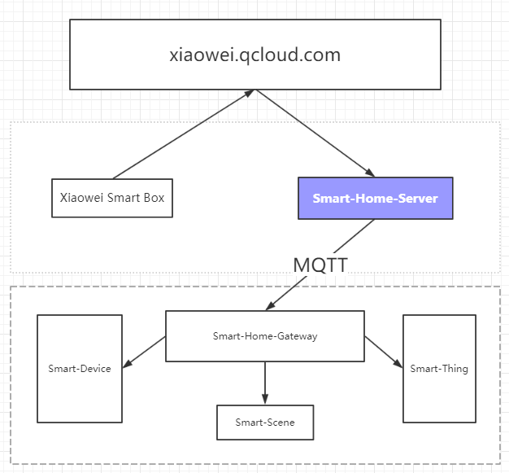

# FPM-Smart-Home-Server

It's a backend server for *Xiaowei* which is the smart service cloud system of qcloud. Here is the url [https://xiaowei.qcloud.com/](https://xiaowei.qcloud.com/).




## About OAuth

This server point give the `OAuth` for the client. And the `access_token` defined as `sn-tinyId-random`, ex: `abcd-144115211875729586-1539218447175`.

So, We can get the major info from the `access_token` of each vioce query.

## Functions

- Discovery
  ```
  这些消息类型用于发现该技能适配器可用的设备和功能.

  示例语句： “小微，发现我的智能家居设备” 目的：发现与最终用户的设备云帐户相关的设备。 DiscoverAppliancesRequest从Smart Home Skill API发送到技能适配器，目的是发现与客户的设备云帐户相关的设备。如果没有设备可以发现，或者您的设备云遇到错误，则技能适配器应返回一个空的DiscoverAppliancesResponse，而不是错误消息。
  ```

- TurnOn
  - Topic: `$s2d/u3/p1/{sn}/trunon`
  - Payload: `deviceId`

  ```
  示例语句： “小微，打开空调” 目的：请求打开指定的设备。
  ```

- TurnOff
  - Topic: `$s2d/u3/p1/{sn}/trunoff`
  - Payload: `deviceId`

  ```
  示例语句： “小微，关闭空调” 目的：请求关闭指定的设备。
  ```

- ActiveScene
  - Topic: `$s2d/u3/p1/{sn}/activeScene`
  - Payload: `sceneId`

  ```
  示例语句： “小微，开启回家模式” 目的：激活回家场景。
  ```

- DeactiveScene
  - Topic: `$s2d/u3/p1/{sn}/deactiveScene`
  - Payload: `sceneId`

  ```
  示例语句： “小微，关闭回家模式” 目的：关闭回家场景。
  ```

**IMPORTANT** All of the Payload ID is String

## Feedback Topics

- `$d2s/u3/p1/update`

  the payload should be like this:
  ```javascript
  {
    abcd: { // the sn code
        discoveredAppliances: [ // the smart switcher
          {
            "actions": [
              "TurnOn",
              "TurnOff"
            ],
            "applianceId": "1", // the origin device id
            "friendlyName": "空调", // the origin device name
            "friendlyDescription": "foo",
            "modelName": "空调",
            "manufacturerName": "foo",
            "additionalApplianceDetails": {},
            "icon": "",
            "version": "1"
          }
        ],
        supportScenes: [  // the smart scene
          {
            "actions": [
              "ActivationScene",
              "DeactivateScene"
            ],
            "sceneId": "1", // the origin sceneid, *IMPORTANT* This should be String
            "sceneName": "回家",  // the origin sceneName
            "icon": ""
          }
        ],
    }
  }
  ```
  *IMPORTANT* This should be String
  *WARNNING*: USER SHOULD REDO `Discovery` 发现我的智能家居设备!

- `$d2s/u3/p1/offline`


## Support Mqtt

Use the `FPM-IOT-CLOUD-MQTT` .


## Manual Links

- 1. Smart Home Skill API

  See [https://xiaowei.qcloud.com/wiki#APIDesc_smart_home_skill_api](https://xiaowei.qcloud.com/wiki#APIDesc_smart_home_skill_api)
